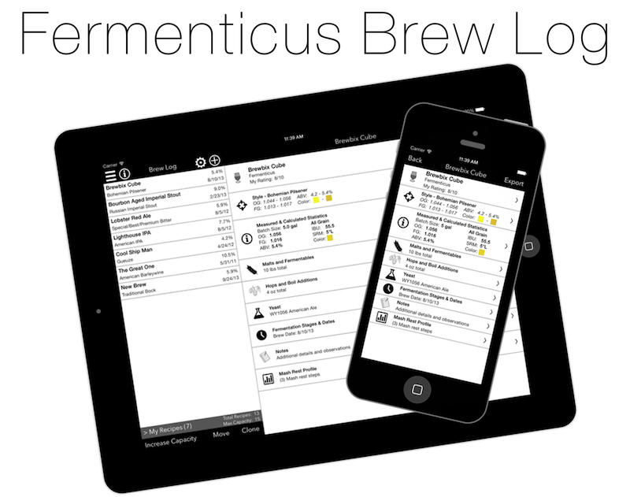

Brew-Log
========

Fermenticus Brew Log - Logbook and Recipe Calculator for Homebrewing

* My first major iOS project, currently available on the App Store, averaging over 1000 new downloads per month and a 4.5 rating.
* A complete recipe management tool for homebrewing beer.  Used for both creation of new recipes, calculations, and logging of important statistics during the brewing process.
* Recently redesigned for iOS 7.
* Utilizes various iOS frameworks such as CoreData, Social, StoreKit (for In-App Purchases), and a mastery of UITableView.
* Since initial release in April 2013, the app has received numerous updates for bug fixes and feature additions.
* Available on the App Store (Free): https://itunes.apple.com/us/app/fermenticus-brew-log/id627800046?mt=8&uo=4 

